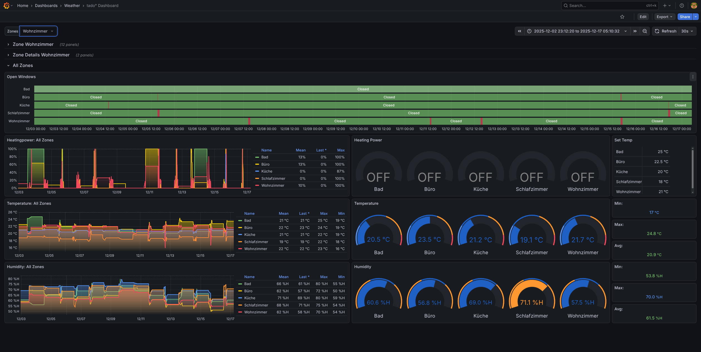

# Tadoº exporter for Prometheus

This software is a little [Python-based exporter](https://github.com/prometheus/client_python) that will expose data
from your Tadoº devices in a [Prometheus](https://prometheus.io) readable format; this way, you can have your neat
pretty graphics wherever you want, and you won't be constrained to use the Tadoº app for Android/iOS. It relies on the
wonderful [libtado](https://github.com/ekeih/libtado).

## Pre-requisites

Retrieve the `CLIENT_SECRET` before running the script otherwise you will get a `401 Unauthorized Access`.

The latest `CLIENT_SECRET` can be found at [https://my.tado.com/webapp/env.js](https://my.tado.com/webapp/env.js). It
will look something like this:

```js
var TD = {
    config: {
        version: 'v588',
        oauth: {
            clientSecret: 'wZaRN7rpjn3FoNyF5IFuxg9uMzYJcvOoQ8QWiIqS3hfk6gLhVlG57j5YNoZL2Rtc'
        }
    }
};
```

An alternative way to get your `CLIENT_SECRET` is to enable the Developper Mode when logging in and catch the Headers.
You will find the form data like this :

```yaml
client_id: tado-web-app
client_secret: fndskjnjzkefjNFRNkfKJRNFKRENkjnrek
grant_type: password
password: MyBeautifulPassword
scope: home.user
username: email@example.com
```

Then you just have to get the value in the attribute `client_secret`. You will need it to connect to your account
through Tado APIs. The `client_secret` never dies so you can base your script on it.

## How to run it

Simply run it via docker. You can use the following command to run it:

```bash
docker run -d -p 8000:8000 ghcr.io/karaktaka/tado-exporter:latest
```

or by using docker compose.

## Configure Prometheus scraper

```yaml
---
scrape_configs:
  - job_name: tado_exporter
    static_configs:
      - targets: [ 'tado-exporter:8000' ]
```

## Grafana Dashboard

Just import the `dashboard.json` file in Grafana. You can find it in the `grafana` folder.


